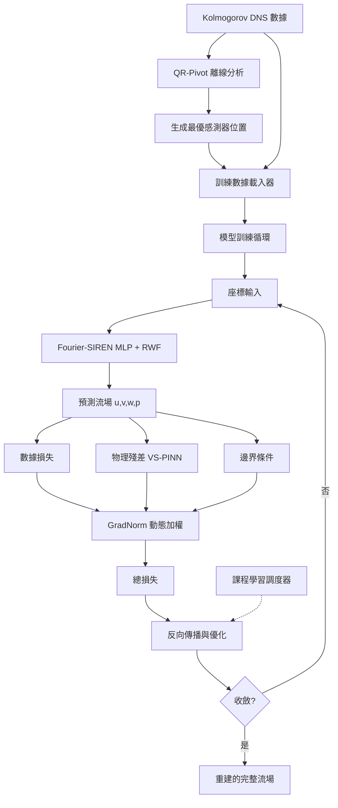

# 🌊 PINNs-MVP: 基於物理資訊神經網路的湍流場重建

**少量資料 × 物理先驗：Kolmogorov Flow 與 JHTDB 通道流的 PINNs 逆重建**

[](https://github.com/latteine/pinns-mvp)
[](docs/KOLMOGOROV_DNS_GUIDE.md)
[](https://pytorch.org/)
[](A100_DEPLOYMENT_GUIDE.md)
[](README.md)

> **使命**：從極度稀疏的感測器觀測中，重建高保真 2D/3D 湍流場；第一階段以自建 **Kolmogorov Flow DNS** 作為設計與收斂驗證基準，第二階段擴展至 **JHTDB 通道流 ($Re_\tau \approx 1000$)**，並結合 RANS 低保真場作為物理軟先驗。

## 🌊 Phase 1: Kolmogorov Flow DNS Datasets (2D Benchmark)

We have generated and validated a comprehensive suite of Direct Numerical Simulation (DNS) datasets for 2D Kolmogorov Flow, serving as the sandbox and "Ground Truth" for PINNs reconstruction and training-stability studies.

### Dataset Overview

| Dataset | Grid Resolution | Re (Target) | Re (Actual) | State | Description |
| :--- | :--- | :--- | :--- | :--- | :--- |
| `dns_re50_t100.h5` | 256x256 | 50 | 35.7 | Transitional | Bursting phenomena, quasi-periodic |
| `dns_re70_t100.h5` | 256x256 | 70 | 60.6 | Weak Turbulence | Richer vortex structures |
| `dns_re100_t100.h5` | 256x256 | 100 | 105.9 | **Turbulence** | **Primary Benchmark**. Fully developed turbulence. |
| `dns_re500_t100.h5` | 512x512 | 500 | 1617.7 | **Strong Turbulence** | **Inverse Cascade**. Large-scale structures dominate. |

### Physics Validation ✅

All datasets have passed rigorous physics validation (`scripts/validate_dns_physics.py`):
- **Incompressibility**: Divergence error $\nabla \cdot u \approx 10^{-14}$ (Spectral), $< 10^{-4}$ (Finite Difference).
- **Resolution**: $\Delta x / \eta < 0.5$ for all cases (Standard requires $< 2.5$), ensuring high-fidelity capture of small scales.
- **Stationarity**: Verified quasi-steady state statistics for t > 40s.

### Visualization
Detailed visualization reports (animations, energy spectra) are available in `results/dns_re*_viz/`.

---

## 📌 項目速覽
- 針對稀疏觀測的湍流逆問題，結合物理約束與神經網路實現穩健重建：先在 2D Kolmogorov Flow 上驗證設計，再遷移到 3D JHTDB 通道流（含 RANS 低保真軟先驗）。
- Fourier-SIREN MLP + VS-PINN + GradNorm/因果訓練，兼顧高頻細節與梯度穩定。
- **Random Weight Factorization (RWF)**：提升深層網路訓練穩定性。
- **RANS Prior Integration**：支援低保真 RANS 場作為軟先驗，透過 `lowfi_prior` 配置動態調整一致性權重。
- **Curriculum Learning**：階段式損失權重調整，支援先驗衰減策略（強→弱），改善壓力梯度重建。
- 配置驅動：所有實驗由 YAML 控制；自動裝置選擇支援 CUDA/MPS/CPU。
- 感測器佈局離線優化（QR-Pivot/DEIM）；DNS 生成與 Re 校準工具內建。

---

## 🚀 快速開始

```bash
# 1) 取得程式碼與環境
git clone https://github.com/latteine/pinns-mvp.git
cd pinns-mvp
conda env create -f environment.yml
conda activate pinns-mvp

# 2) 生成或下載 Kolmogorov Flow DNS（參見 docs/KOLMOGOROV_DNS_GUIDE.md）
python scripts/generate_kolmogorov_dns.py \
  --N 512 --nu 0.0125 --k_f 8 --T_end 40.0 \
  --output data/kolmogorov_dns_re56_512x512_kf8_midway.h5

# 3a) 執行 2D Kolmogorov Flow 訓練（配置驅動）
# 最新的 Re=50 基準實驗，啟用 RWF 與因果訓練
python scripts/train.py --cfg configs/kolmogorov_re50_kf4_K100.yml

# 3b) 執行 3D JHTDB 通道流訓練（需先準備 JHTDB cutout 與 RANS 先驗）
# 具體資料準備流程請參考 docs/TECHNICAL_DOCUMENTATION.md 及 configs/README.md
python scripts/train.py --cfg configs/main.yml
```

更多硬體與部署建議：`A100_DEPLOYMENT_GUIDE.md`。配置模板：`configs/templates/`。

---

## 核心技術深度解析

本專案結合多項技術，解決湍流重建的高頻、多尺度與梯度剛性挑戰，並在 2D Kolmogorov Flow 與 3D JHTDB 通道流上共用同一套架構設計。

### 1. 模型架構: Fourier-SIREN MLP + RWF
- **傅立葉特徵**：先將 `(t, x, y, z)` 映射到高維頻域，消除 MLP 的頻譜偏差。
- **正弦激活 (SIREN)**：`sin(ωx)` 使高階導數平滑，適合 PDE 殘差計算。
- **Random Weight Factorization (RWF)**：分解權重為方向與長度 ($W=\exp(s) \cdot V$)，改善深層網路的優化風景與收斂性（PirateNet 論文）。
- **Adaptive Residual 機制**：透過 `block_type='resnet'` 啟用 PirateNet-style Adaptive Skip Connection (`y = α·f(x) + (1-α)·x`)，從淺層（α≈0）逐步增深網路。

### PINNs 內部運作流 (Internal Workflow)
1. **輸入準備**：原始座標與監測點物理量 → `UnifiedNormalizer` 標準化；VS-PINN 依各向異性縮放座標。
2. **神經網路**：`fourier_mlp.PINNNet` (with RWFLinear) 進行 Fourier 特徵映射與 SIREN MLP；內建 `fourier_normalize_input` 確保頻率穩定。
3. **輸出後處理**：`OutputTransform` 將標準化輸出還原至物理量 (u, v, w, p)。
4. **損失與權重**：`residuals.py` 計算 PDE/邊界/數據損失，`priors.py` 提供均值約束；`weighting.py` 中的 GradNorm/因果/自適應排程平衡權重。
5. **優化流程**：彙總總損失 → 反向傳播 → `Adam/LBFGS/SOAP` 更新；學習率由 `WarmupCosineScheduler` 等策略調度。
6. **檢查點與物理驗證**：保存模型與標準化參數前執行物理一致性檢查。

### 2. 物理引擎: 變數縮放 PINN (VS-PINN)
- **非等向縮放**：`(X, Y, Z) = (N_x·x, N_y·y, N_z·z)`，以大幅放大壁法向梯度 (例 `N_y=12`)，平衡剛性。
- **鏈式法則修正**：PDE 殘差計算時對導數加入縮放係數，如 `∂u/∂x = N_x · ∂u/∂X`。
- **效果**：反向傳播時各向梯度均衡，提升收斂性與穩定度。

### 3. 數據策略: QR 分解感測器佈局
- **QR-Pivoting**：對 DNS 快照矩陣進行列主元 QR，挑選資訊量最高的行作為感測器位置。
- **離線生成**：訓練前產生感測器位置文件，訓練僅讀取這些點作監督信號。

### 4. 訓練策略: 自適應權重、課程學習、因果訓練、RANS 先驗
- **GradNorm**：動態平衡各損失項的梯度範數，避免單一損失主導。
- **因果權重**：`w(t) = exp(-ε × ∫₀ᵗ Loss(τ)dτ)`，強化早期時間點的物理約束，配置中啟用 `losses.causal_weighting`。
- **課程學習**：多階段調整學習率與損失權重，先擬合數據再強化物理，再精修細節。支援 RANS 先驗衰減策略（Stage 1: prior_weight=1.0 → Stage 2: 0.3 → Stage 3: 0.1）。
- **RANS 低保真先驗**：`PriorLossManager` 動態調整 `consistency_weight`，將 RANS 平均場作為軟約束，改善壓力梯度重建（目標 ∇p L2 < 30%）。

---

## 總體工作流程



---

## 相關文件與資源
- DNS 生成與校準：`docs/KOLMOGOROV_DNS_GUIDE.md`, `scripts/README_REYNOLDS_CALCULATOR.md`
- A100 部署：`A100_DEPLOYMENT_GUIDE.md`
- 感測器與 QR-Pivot：`scripts/README.md`, `docs/QR_SENSOR_VISUALIZATION_GUIDE.md`
- 配置模板：`configs/templates/`，更多設定見 `configs/README.md`
- RANS 先驗使用：`docs/RANS_PRIOR_GUIDE.md`
- 課程學習設定：`docs/KOLMOGOROV_CURRICULUM_GUIDE.md`

## 📈 最近更新 (2025-12-12)

### ✅ RANS Prior Loss Integration
- **實作完成**：`PriorLossManager` 完整整合至 `trainer.py`，支援動態一致性權重調整
- **配置支援**：`lowfi_prior` 配置區塊，可設定 `consistency_weight` 與 `variable_weights`
- **訓練驗證**：已驗證 prior loss 正確計算並記錄至訓練日誌與 TensorBoard

### ✅ Curriculum Learning with Prior Decay
- **策略設計**：3 階段損失權重調整（固定 Re=50）
  - Stage 1 (0-300): 強先驗引導 (prior_weight=1.0, PDE=0.5)
  - Stage 2 (300-700): 平衡先驗與物理 (prior_weight=0.3, PDE=1.0)
  - Stage 3 (700-1000): 弱先驗精煉 (prior_weight=0.1, PDE=1.0)
- **配置檔案**：`configs/kolmogorov_re50_kf4_K100_rans_curriculum.yml`
- **目標指標**：壓力梯度 L2 error < 30% (vs 目前 ~100%)

### 🔧 CurriculumScheduler 修正
- **問題修正**：修正 Kolmogorov Flow 配置中 `Re_tau` → `Re` 的錯誤映射
- **兼容性**：支援 Channel Flow (`Re_tau`, `pressure_gradient`) 與 Kolmogorov Flow (`Re`, `forcing_amplitude`) 兩種場景

### ⚠️ 已知限制
- **記憶體需求**：MPS (Apple Silicon) 在 10K PDE 點時可能 OOM（20GB 限制），建議降低至 5K 或使用 CUDA GPU

## 📈 Roadmap / Future Work

- **架構消融實驗**：系統性比較 Fourier-VS-PINN baseline、僅 RWF、僅 adaptive residual、與完整組合，在 2D Kolmogorov 與 3D JHTDB 通道流上量化各元件貢獻（收斂速度與最終誤差）。
- **不確定性量化 (UQ)**：在現有 RWF + VS-PINN 架構上整合 B-PINNs、NN-aPC 或 ensemble PINNs，輸出帶置信區間的重建結果。
- **進階架構**：探索 Kolmogorov–Arnold Networks（KAN）等更具表達力的 backbone，並與現有 Fourier-SIREN + RWF 組合比較。
- **自適應採樣與感測**：將 QR-DEIM 型自適應 collocation 與 randomized QRCP 感測設計整合進訓練流程，提升在更高 $Re_\tau$ 與更嚴苛感測預算下的可擴展性。
- **RANS Prior 完整評估**：完成 1000 epoch 訓練並與固定權重基準（`kolmogorov_re50_kf4_K100_rans_prior_1k.yml`）進行對比分析。

## 貢獻與授權
- 歡迎 Issue/PR，遵循一般 Fork & PR 流程。
- 授權：MIT。若在研究中引用，請註明本專案網址。
